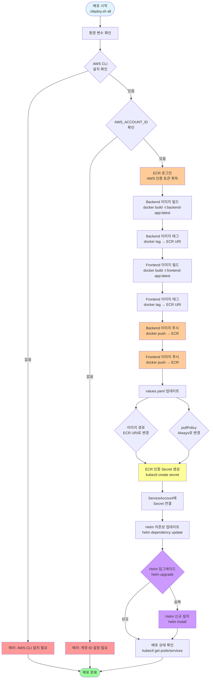

## 배포 프로세스 흐름도 (deploy.sh 기반-실제 운영 환경과는 차이가 있음)

```mermaid
flowchart TD
    START([배포 시작<br/>./deploy.sh all]) --> CHECK_ENV[환경 변수 확인]
    
    CHECK_ENV --> CHECK_AWS{ AWS CLI<br/>설치 확인 }
    CHECK_AWS -->|없음| ERROR_AWS[에러: AWS CLI 설치 필요]
    CHECK_AWS -->|있음| CHECK_ACCOUNT{ AWS_ACCOUNT_ID<br/>확인 }
    
    CHECK_ACCOUNT -->|없음| ERROR_ACCOUNT[에러: 계정 ID 설정 필요]
    CHECK_ACCOUNT -->|있음| ECR_LOGIN[ECR 로그인<br/>AWS 인증 토큰 획득]
    
    ECR_LOGIN --> BUILD_BACKEND[Backend 이미지 빌드<br/>docker build -t backend-app:latest]
    BUILD_BACKEND --> TAG_BACKEND[Backend 이미지 태그<br/>docker tag → ECR URI]
    
    TAG_BACKEND --> BUILD_FRONTEND[Frontend 이미지 빌드<br/>docker build -t frontend-app:latest]
    BUILD_FRONTEND --> TAG_FRONTEND[Frontend 이미지 태그<br/>docker tag → ECR URI]
    
    TAG_FRONTEND --> PUSH_BACKEND[Backend 이미지 푸시<br/>docker push → ECR]
    PUSH_BACKEND --> PUSH_FRONTEND[Frontend 이미지 푸시<br/>docker push → ECR]
    
    PUSH_FRONTEND --> UPDATE_VALUES[values.yaml 업데이트]
    UPDATE_VALUES --> UPDATE_REPO{ 이미지 경로<br/>ECR URI로 변경 }
    UPDATE_VALUES --> UPDATE_POLICY{ pullPolicy<br/>Always로 변경 }
    
    UPDATE_REPO --> CREATE_SECRET[ECR 인증 Secret 생성<br/>kubectl create secret]
    UPDATE_POLICY --> CREATE_SECRET
    
    CREATE_SECRET --> PATCH_SA[ServiceAccount에<br/>Secret 연결]
    
    PATCH_SA --> HELM_DEPS[Helm 의존성 업데이트<br/>helm dependency update]
    
    HELM_DEPS --> HELM_UPGRADE{ Helm 업그레이드<br/>helm upgrade }
    
    HELM_UPGRADE -->|성공| STATUS_CHECK[배포 상태 확인<br/>kubectl get pods/services]
    HELM_UPGRADE -->|실패| HELM_INSTALL[Helm 신규 설치<br/>helm install]
    
    HELM_INSTALL --> STATUS_CHECK
    
    STATUS_CHECK --> END([배포 완료])
    
    ERROR_AWS --> END
    ERROR_ACCOUNT --> END
    
    style START fill:#e1f5ff
    style END fill:#99ff99
    style ERROR_AWS fill:#ff9999
    style ERROR_ACCOUNT fill:#ff9999
    style ECR_LOGIN fill:#ffcc99
    style PUSH_BACKEND fill:#ffcc99
    style PUSH_FRONTEND fill:#ffcc99
    style CREATE_SECRET fill:#ffff99
    style HELM_UPGRADE fill:#cc99ff
    style HELM_INSTALL fill:#cc99ff
```