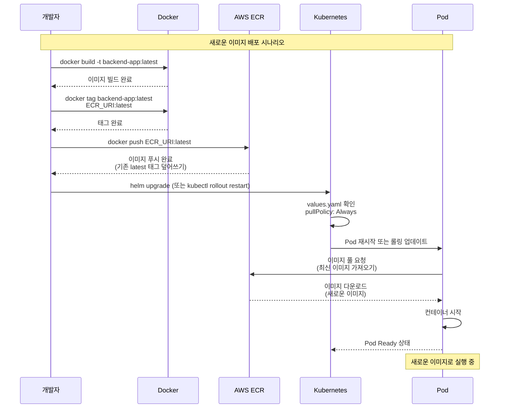

## 이미지 업데이트 프로세스 (deploy.sh 기반-실제 운영 환경과는 차이가 있음)

```mermaid
sequenceDiagram
    participant Dev as 개발자
    participant Docker as Docker
    participant ECR as AWS ECR
    participant K8s as Kubernetes
    participant Pod as Pod
    
    Note over Dev,Pod: 새로운 이미지 배포 시나리오
    
    Dev->>Docker: docker build -t backend-app:latest
    Docker-->>Dev: 이미지 빌드 완료
    
    Dev->>Docker: docker tag backend-app:latest<br/>ECR_URI:latest
    Docker-->>Dev: 태그 완료
    
    Dev->>ECR: docker push ECR_URI:latest
    ECR-->>Dev: 이미지 푸시 완료<br/>(기존 latest 태그 덮어쓰기)
    
    Dev->>K8s: helm upgrade (또는 kubectl rollout restart)
    K8s->>K8s: values.yaml 확인<br/>pullPolicy: Always
    
    K8s->>Pod: Pod 재시작 또는 롤링 업데이트
    
    Pod->>ECR: 이미지 풀 요청<br/>(최신 이미지 가져오기)
    ECR-->>Pod: 이미지 다운로드<br/>(새로운 이미지)
    
    Pod->>Pod: 컨테이너 시작
    Pod-->>K8s: Pod Ready 상태
    
    Note over Pod: 새로운 이미지로 실행 중
```